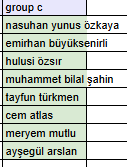

# 💰 Money Guard - Finansal Özgürlüğe Açılan Kapınız

**Money Guard**, kişisel harcamalarınızı kolayca takip etmeniz, gelir ve giderlerinizi analiz etmeniz ve finansal hedeflerinize ulaşmanız için tasarlanmış modern ve sezgisel bir web uygulamasıdır. Paranızı yönetmek hiç bu kadar kolay ve şık olmamıştı!

---

## ✨ Öne Çıkan Özellikler

- **💸 Gelir ve Gider Takibi:** Tüm para hareketlerinizi tek bir yerden kaydedin ve yönetin.
- **📊 Etkileşimli İstatistikler:** Harcamalarınızı renkli grafikler ve detaylı tablolarla analiz edin. Hangi kategoriye ne kadar harcadığınızı anında görün.
- **📅 Tarihe Göre Filtreleme:** Belirli bir ay ve yıla ait işlem özetinizi kolayca görüntüleyin.
- **🔄 Anlık Bakiye:** Toplam bakiyeniz her işlemde anında güncellenir.
- **💵 Döviz Kurları:** Monobank API'si ile entegre, güncel döviz kurlarını takip edin (USD, EUR).
- **🔐 Güvenli Kimlik Doğrulama:** Kişisel finansal verileriniz güvende. Kayıt olun, giriş yapın ve güvenle kullanın.
- **📱 Tamamen Duyarlı (Responsive) Tasarım:** İster masaüstü, ister tablet, ister mobil cihazınızdan kusursuz bir deneyim yaşayın.
- **🎨 Modern ve Kullanıcı Dostu Arayüz:** Finansal yönetimi sıkıcı bir görevden keyifli bir alışkanlığa dönüştüren şık tasarım.

---

## 🛠️ Kullanılan Teknolojiler

Bu proje, en modern web teknolojileri kullanılarak geliştirilmiştir:

- **Frontend:** [React](https://reactjs.org/)
- **State Management:** [Redux Toolkit](https://redux-toolkit.js.org/)
- **Routing:** [React Router](https://reactrouter.com/)
- **Stil:** CSS Modules, [Clsx](https://github.com/lukeed/clsx)
- **Form Yönetimi:** [React Hook Form](https://react-hook-form.com/)
- **Veri Görselleştirme:** [Recharts](https://recharts.org/)
- **API İstekleri:** [Axios](https://axios-http.com/)
- **Build Aracı:** [Vite](https://vitejs.dev/)
- **Linting:** [ESLint](https://eslint.org/)

---

## 🚀 Projeyi Yerel Makinede Çalıştırma

Projeyi kendi bilgisayarınızda denemek için aşağıdaki adımları izleyin:

1.  **Projeyi klonlayın:**
    ```bash
    git clone https://github.com/your-username/money-transaction-teamhw-group-c-main.git
    ```

2.  **Proje dizinine gidin:**
    ```bash
    cd money-transaction-teamhw-group-c-main
    ```

3.  **Gerekli paketleri yükleyin:**
    ```bash
    npm install
    ```

4.  **Geliştirme sunucusunu başlatın:**
    ```bash
    npm run dev
    ```

5.  Tarayıcınızda `http://localhost:5173` (veya terminalde belirtilen adresi) açın.

---

## 👥 Ekip

Bu proje, harika bir ekip çalışmasının ürünüdür:

**Grup C**



---

Finansal durumunuzu kontrol altına almaya hazır mısınız? **Money Guard** ile başlayın!
